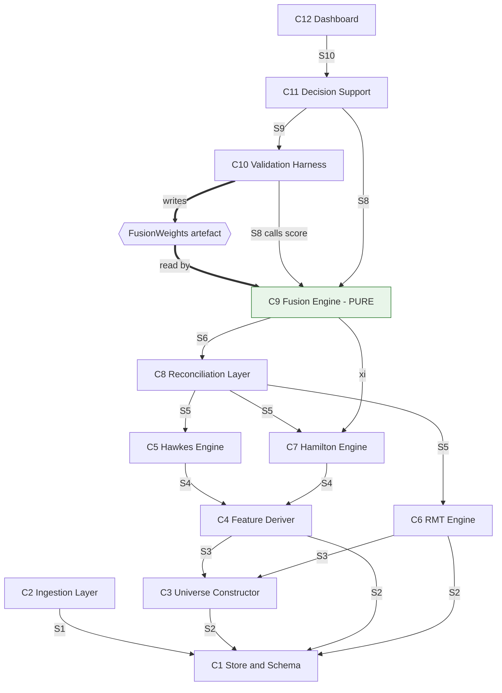

# ARCHITECTURE.md — SERAPH — v2

**Derived from:** `SPEC.md` v3.1 (authoritative). Every component and contract traces to an FR. Nothing here adds a requirement.
**Status:** Design. No implementation code.

### Changelog v1 → v2
1. **§7 DECISIONS added** — five previously-open items resolved: D1 weight artefact direction, D2 missing-pillar handling, D3 eigenvector rotation artefacts, D4 `R^(p)(·)` functional form (SPEC OQ10), D5 train/test split (SPEC OQ12).
2. **`AvailabilityMask` added** to the type system; `CsrsPoint` now carries it.
3. **`Ω_t` redefined** on common support — this was a latent correctness bug, not just noise.
4. **CT-3 promoted to first** in the integration seam order.
5. **Risk register updated** — R1, R3, R5 now carry resolutions.

### Notation caveat
SPEC NFR36 fixes the stack as Python 3.10+ / PostgreSQL+TimescaleDB / Streamlit. **TypeScript below is an interface description language only** — the most precise available notation for shapes and error variants. It is not a claim about implementation language.

| TS construct | Python realisation |
|---|---|
| `interface` / `type` | `pydantic.BaseModel`, validated at every seam |
| union on `status` / `kind` | `pydantic` model with `Literal` discriminator |
| `readonly` | frozen model config |
| `Vec3` / `Mat3` | `numpy.ndarray` with asserted shape |

**The shapes are binding. The language is not.**

---

## 0. SHARED TYPES

```ts
type ISODate      = string;   // "YYYY-MM-DD"
type ISOTimestamp = string;   // "YYYY-MM-DDTHH:mm:ss+05:30" — IST, always explicit
type Symbol       = string;
type SectorId     = string;
type RunId        = string;
type Sha256       = string;

type Vec3     = readonly [number, number, number];
type Mat3     = readonly [Vec3, Vec3, Vec3];
type Simplex3 = Vec3;   // invariant: sum === 1 (±1e-9), all >= 0

/**
 * PILLAR ORDER IS GLOBAL AND FIXED: [Hawkes, RMT, Hamilton].
 * Every Vec3, Mat3 and mask in this system uses this order.
 * Violating it is the easiest way to produce a silently wrong CSRS.
 */
const PILLAR_ORDER = ["hawkes", "rmt", "hamilton"] as const;
type PillarId = typeof PILLAR_ORDER[number];

/** D2 — which pillars carry genuine information at this timestamp. */
type AvailabilityMask = readonly [boolean, boolean, boolean];

type Ok<T> = { status: "ok"; value: T; warnings: readonly Warning[] };
type Err   = { status: "error"; error: SeraphError };
type Result<T> = Ok<T> | Err;

type Warning = { code: WarningCode; message: string;
                 context: Readonly<Record<string, string | number>> };

type WarningCode =
  | "PARTIAL_COVERAGE" | "ESTIMATOR_FALLBACK" | "STALE_OBSERVATION"
  | "LOW_EVENT_COUNT" | "UNIVERSE_UNDERFILLED" | "SOURCE_SCHEMA_LEGACY"
  | "MASK_DEGRADED"            // D2: scoring on fewer than 3 pillars
  | "REBALANCE_ADJACENT"       // D3: Ω_t computed across a membership change
  | "COMMON_SUPPORT_LOW"       // D3: eigenvector overlap below floor
  | "NOISE_SATURATED";         // D4: R^(p) at ceiling, pillar contributing ~nothing

type SeraphError =
  | { kind: "SOURCE_UNAVAILABLE";   source: string; httpStatus?: number; retryable: true }
  | { kind: "SOURCE_BLOCKED";       source: string; hint: "residential-ip-required"; retryable: false }
  | { kind: "SCHEMA_MISMATCH";      source: string; expected: string; received: string; retryable: false }
  | { kind: "INSUFFICIENT_HISTORY"; required: number; available: number; asOf: ISODate; retryable: false }
  | { kind: "ESTIMATION_DIVERGED";  estimator: string; iterations: number; lastObjective: number; retryable: false }
  | { kind: "CONSTRAINT_VIOLATED";  constraint: string; observed: number; bound: number; retryable: false }
  | { kind: "MISSING_DEPENDENCY";   entity: string; asOf: ISOTimestamp; retryable: true }
  | { kind: "EMPTY_MASK";           ts: ISOTimestamp; retryable: false }   // D2 degenerate case
  | { kind: "CONTRACT_VIOLATION";   field: string; detail: string; retryable: false };
```

`SOURCE_BLOCKED` exists because NSE blocks datacentre IPs — a verified constraint, surfaced as non-retryable so it does not burn retries.

---

## 1. COMPONENT MAP

Twelve components, one responsibility each.

| ID | Name | Responsibility (single sentence) | FRs | Owns exclusively | Owner |
|---|---|---|---|---|---|
| **C1** | Store & Schema | Own the physical schema and provide typed versioned access to every persisted entity. | 8, 38 | All DDL; hypertable partitioning; migrations; the only connection pool. E1–E14 exist nowhere else. | A |
| **C2** | Ingestion Layer | Land raw external series into the store unmodified except for schema normalisation. | 1, 2, 3, 4, 7, 51 | All outbound network I/O; Kite credentials; retry/backoff; per-source watermarks; both bhavcopy schema readers. | A/B/D |
| **C3** | Universe Constructor | Determine point-in-time universe membership at each rebalance date. | 52, 54 | `universe_member_flag`; the rebalance calendar; the eligibility rule; the D3 buffer rule. | A |
| **C4** | Feature Deriver | Compute every derived series that pillars consume from raw stored inputs. | 5, 6, 22, 50, 53 | E2 in full; `is_jump`/`jump_sign`; `yz_volatility`; `G_t`; **`AR_t`**; `BAS_t`; all estimator parameters. | A/B |
| **C5** | Hawkes Engine | Produce jump-contagion sub-scores from jump events and microstructure state. | 10–15 | E6; kernel parameterisation; spectral-radius regulariser; `Φ(S_t)` and the contagion network. | B |
| **C6** | RMT Engine | Produce spectral coupling sub-scores from the rolling universe correlation matrix. | 16–19 | E7; eigendecomposition; MP bounds; the 1,000-replication bootstrap; the D3 common-support rotation. | A |
| **C7** | Hamilton Engine | Produce regime probabilities and the liquidity stress sub-score from `y_t` and `z_t`. | 20, 21, 23, 24 | E8; TVTP coefficients `γ_ij`; the EM procedure; regime moments; half-lives. | C |
| **C8** | Reconciliation Layer | Maintain a time-aligned latent pillar-state estimate with age-aware uncertainty. | 25–27 | E9; `Q_proc`; **`R^(p)(·)` per D4**; per-pillar `τ^(p)`; the forward-fill baseline. | C |
| **C9** | Fusion Engine | Score a reconciled pillar vector into a CSRS, **given a fixed weight set**. | 28, 29, 31 | E10; the empirical-CDF standardiser; Shapley; the D2 mask renormalisation. | D |
| **C10** | Validation Harness | Evaluate scoring configurations against labelled epochs and emit calibrated weights. | 30, 32–37 | E13; epoch labels; **the D5 split policy**; the loss `L`; the `FusionWeights` artefact; the ablation runner. | D |
| **C11** | Decision Support | Translate scored output into role-specific artefacts. | 43–49 | E11; E12; explanation templates; playbook queries; both simulators. | D |
| **C12** | Dashboard | Render system state to the authenticated user at their permitted role. | 39–42 | Presentation; RBAC at the view boundary; threshold display. | D |

**Two deliberate coupling decisions:**

- **`AR_t` is computed in C4, not C6.** Placing it in the RMT engine would make Pillar 3 import Pillar 2, coupling two pillars SPEC treats as independent and corrupting FR35 — you could not evaluate Hamilton standalone if it depended on RMT. Duplicating a covariance computation is the correct price.
- **C12 contains no analytics.** Every number is fetched, never computed. A chart needing a value no component produces is a missing FR, not a dashboard feature.

**Traceability:** all 47 live FRs covered exactly once. FR9 is a SPEC tombstone and correctly maps to nothing.

---

## 2. INTERFACE CONTRACTS

Binding. A component built against a different signature is a defect.

### S1 — C2 → C1 (ingestion writes)

```ts
type IngestBatch<E> = {
  readonly runId: RunId;
  readonly source: "eod2"|"bhavcopy"|"kite"|"rbi"|"fred"|"nse-fii-dii"|"tariff-manual";
  readonly entity: "E1"|"E3"|"E4"|"E5"|"E14";
  readonly rows: readonly E[];
  readonly watermark: ISOTimestamp;
  readonly sourceSchemaVersion: string;   // "bhavcopy-legacy" | "bhavcopy-udiff"
};

interface StoreWriter {
  /** Idempotent on (entity, natural key). Re-running must not duplicate. */
  writeBatch<E>(b: IngestBatch<E>): Promise<Result<{inserted:number; updated:number}>>;
  getWatermark(source: string, entity: string): Promise<Result<ISOTimestamp|null>>;
}
```

Idempotency is a hard requirement, not an optimisation — NSE sources fail often and ingestion will be re-run after every failure.

### S2 — C1 → everything (typed reads)

```ts
interface StoreReader {
  dailyBars(q:{symbols?:readonly Symbol[]; from:ISODate; to:ISODate; universeOnly:boolean})
    : Promise<Result<readonly DailyBar[]>>;
  intradayBars(q:{symbols:readonly Symbol[]; from:ISOTimestamp; to:ISOTimestamp})
    : Promise<Result<readonly IntradayBar[]>>;
  macroCovariates(q:{from:ISODate; to:ISODate}): Promise<Result<readonly MacroRow[]>>;
  microstructureState(q:{symbols:readonly Symbol[]; from:ISOTimestamp; to:ISOTimestamp})
    : Promise<Result<readonly MicroState[]>>;
}

type DailyBar = {
  readonly symbol:Symbol; readonly date:ISODate;
  readonly open:number; readonly high:number; readonly low:number; readonly close:number;
  readonly volume:number;
  readonly tottrdval:number;        // split-invariant — SPEC E3 note
  readonly adjClose:number;
  readonly universeMember:boolean;  // written by C3, never C2
  readonly listingDaysToDate:number;
};

type IntradayBar = {
  readonly symbol:Symbol; readonly ts:ISOTimestamp;
  readonly open:number; readonly high:number; readonly low:number; readonly close:number;
  readonly volume:number;
  readonly signedVolume:number;     // FR5, written by C4
  readonly logReturn:number;
  readonly isJump:boolean;          // FR50, written by C4
  readonly jumpSign:-1|0|1;         // 0 iff !isJump
};

type MacroRow = {
  readonly date:ISODate;
  readonly rbiRepoRate:number|null;
  readonly bankCreditGrowthYoy:number|null;
  readonly indiaVix:number|null;    // null before Nov 2007
  readonly vixAvailable:boolean;
  readonly inrTwi:number|null;
  readonly brentPrice:number|null;
  readonly gT:number|null;          // FR22, written by C4
  readonly gTSectorWeighted:number|null;
};

type MicroState = {
  readonly symbol:Symbol; readonly ts:ISOTimestamp;
  readonly spreadAr:number|null;    // null when undefined → warning, not error
  readonly spreadCs:number|null;
  readonly amihudIlliq:number|null;
  readonly signedVolImbalance:number;
  readonly spreadQuintile:1|2|3|4|5;
  readonly imbalanceQuintile:1|2|3|4|5;
  readonly sT:number;               // 1..25 — FR6
};
```

### S3 — C3 → C1/C6 (universe membership)

```ts
type UniverseSnapshot = {
  readonly rebalanceDate: ISODate;
  readonly members: readonly Symbol[];       // invariant: length === 500
  readonly eligibleCount: number;
  readonly entrants: readonly Symbol[];      // D3: churn is explicit, not inferred
  readonly leavers: readonly Symbol[];
  readonly churnFraction: number;            // D3: |entrants| / 500
  readonly rule: {
    readonly minListingDays: 1000;           // FR52 step 1
    readonly rankBy: "median_6m_tottrdval";  // FR52 step 2
    readonly take: 500;                      // FR52 step 3
    readonly order: "filter_then_rank";      // FR52 explicit warning
    readonly bufferIncumbentRank: 550;       // D3
    readonly bufferEntrantRank: 450;         // D3
  };
};

interface UniverseConstructor {
  build(asOf: ISODate): Promise<Result<UniverseSnapshot>>;
  membersAt(date: ISODate): Promise<Result<readonly Symbol[]>>;
  /** FR54 — representativeness evidence, not a gate. */
  validateAgainstOfficialIndex(from:ISODate, to:ISODate)
    : Promise<Result<{correlation:number; nObs:number}>>;
}
```

`members.length === 500` is a contract invariant. Fewer than 500 eligible → `UNIVERSE_UNDERFILLED` warning with the shortfall, never a silent 480 that lets `Q = T/N = 2` drift.

### S4 — C4 → C5/C6/C7 (derived features)

```ts
interface FeatureDeriver {
  jumpEvents(q:{symbols:readonly Symbol[]; from:ISOTimestamp; to:ISOTimestamp})
    : Promise<Result<readonly JumpEvent[]>>;
  microstructureState(q:{symbols:readonly Symbol[]; from:ISOTimestamp; to:ISOTimestamp})
    : Promise<Result<readonly MicroState[]>>;
  observationVector(q:{from:ISODate; to:ISODate})
    : Promise<Result<readonly ObservationRow[]>>;   // y_t, FR20
  covariateVector(q:{from:ISODate; to:ISODate})
    : Promise<Result<readonly MacroRow[]>>;         // z_t incl. G_t, FR22
  /** FR53 — estimator substitution validation. */
  volatilityEstimatorAgreement(from:ISODate, to:ISODate)
    : Promise<Result<{correlation:number; nOverlappingDays:number}>>;
}

type JumpEvent = {
  readonly symbol:Symbol; readonly sectorId:SectorId; readonly ts:ISOTimestamp;
  readonly sign:-1|1; readonly magnitude:number;
  readonly testStatistic:number;    // Lee–Mykland
  readonly sT:number;               // state at event time
};

type ObservationRow = {
  readonly date:ISODate;
  readonly rvYangZhang:number;
  readonly rv5Min:number|null;      // null before intraday coverage
  readonly arT:number;              // computed HERE, not in C6
  readonly basT:number;
};
```

### S5 — Pillars → C8 (**the critical seam**)

```ts
/**
 * `tau` is when the pillar was ACTUALLY COMPUTED — never the query time,
 * never a forward-filled time. C8's R^(p)(t - tau) is only correct if honest.
 */
type PillarObservation = {
  readonly pillar: PillarId;
  readonly ts: ISOTimestamp;                    // valid AS OF
  readonly tau: ISOTimestamp;                   // COMPUTED at
  readonly value: number;                       // MTS_t | SCA_t | LSD_t
  readonly estimationVariance: number|null;     // FR23 for Hamilton; null → C8 uses prior
};

/**
 * Absence is a first-class VALUE, not an error and not a zero.
 * `structural_absence` means the pillar cannot exist for this period at all
 * (e.g. Hawkes pre-2015) and drives D2 mask exclusion.
 * `transient_absence` means it should exist but this update failed —
 * D4 age-inflation applies and the pillar stays in the mask.
 */
type PillarEmission =
  | { readonly kind:"observed";  readonly obs: PillarObservation }
  | { readonly kind:"unavailable"; readonly pillar:PillarId; readonly ts:ISOTimestamp;
      readonly absence:"structural"|"transient";
      readonly reason:"no_data_coverage"|"estimation_failed"|"insufficient_history" };

interface PillarEngine {
  readonly pillar: PillarId;
  emit(ts:ISOTimestamp): Promise<Result<PillarEmission>>;
  emitRange(from:ISOTimestamp, to:ISOTimestamp): Promise<Result<readonly PillarEmission[]>>;
  /** D2 — declares the period over which this pillar can exist at all. */
  coverage(): Promise<Result<{from:ISOTimestamp; to:ISOTimestamp}>>;
}
```

**`unavailable` returns `Ok`, not `Err`, deliberately.** A missing Hawkes score in 2008 is expected behaviour per SPEC §4. Modelling it as an error pushes retry logic into C8 and destroys the `R → ∞` design that O6 rests on.

**The `structural` / `transient` split is what D2 turns on.** Transient absence → the pillar stays in the mask and its noise inflates. Structural absence → the pillar leaves the mask entirely.

Detail rides alongside, never inside, the common shape:

```ts
type HawkesDetail = {   // C5
  readonly branchingRatio:number;              // invariant: < 1 (FR11)
  readonly asymmetryRatio:number;
  readonly jumpCountNeg:number; readonly jumpCountPos:number;
  readonly sectorFlags: readonly {sectorId:SectorId; n:number; flag:"none"|"amber"}[];
  readonly branchingMatrix: readonly (readonly number[])[];
};

type RmtDetail = {      // C6
  readonly fT:number; readonly vEigT:number; readonly omegaT:number;
  readonly mpPValue:number; readonly lambdaMinus:number; readonly lambdaPlus:number;
  readonly leadingEigenvector: readonly number[];
  readonly commonSupportFraction:number;       // D3
  readonly rebalanceAdjacent:boolean;          // D3
};

type HamiltonDetail = { // C7
  readonly xi: Simplex3;                       // [tranquil, stressed, crisis]
  readonly pHat22:number; readonly pHat33:number;
  readonly tauHalfStressed:number; readonly tauHalfCrisis:number;
};
```

### S6 — C8 → C9 (reconciled state)

```ts
type ReconciledState = {
  readonly ts: ISOTimestamp;
  readonly xHat: Vec3;                         // PILLAR_ORDER
  readonly P: Mat3;                            // symmetric PSD — asserted, not assumed
  readonly tauLastUpdate: readonly [ISOTimestamp|null, ISOTimestamp|null, ISOTimestamp|null];
  readonly mask: AvailabilityMask;             // D2 — set by C8, consumed by C9
  readonly noiseSaturated: readonly [boolean,boolean,boolean];  // D4
  readonly mode: "kalman"|"forward_fill";      // FR27
};

interface ReconciliationLayer {
  predict(toTs:ISOTimestamp): Promise<Result<ReconciledState>>;
  update(emissions: readonly PillarEmission[]): Promise<Result<ReconciledState>>;
  stateAt(ts:ISOTimestamp): Promise<Result<ReconciledState>>;
}
```

Boundary invariant: **`trace(P)` is non-decreasing between updates and strictly decreasing at an update arrival.** That is SPEC O6's acceptance criterion as a runtime assertion.

### S7 — C10 → C9 (**the cycle break — note the direction**)

```ts
type FusionWeights = {
  readonly artefactId: Sha256;                 // hash of weights + calibration config
  readonly calibratedOn: {
    readonly epochs: readonly EpochId[];       // WHICH epochs trained these
    readonly splitPolicy: "leave_one_epoch_out";   // D5
    readonly foldHeldOut: EpochId|null;        // D5 — null only for the final refit
    readonly kappaMiss:number; readonly kappaFa:number;
    readonly maskProfile: AvailabilityMask;    // D2 — which pillars were available in training
  };
  readonly w: readonly [Simplex3, Simplex3, Simplex3];   // w_j per regime j
  readonly ecdfWindowYears: 5;
};

type EpochId = "gfc_2008"|"taper_2013"|"ilfs_2018"|"covid_2020"|"tightening_2022"|"tariff_2026";
```

**C10 produces this artefact. C9 consumes it. C9 does not import C10.** C9 depends on the *type*, which lives in shared types — not on the component.

### S8 — C9 (pure scoring)

```ts
interface FusionEngine {
  /** PURE. No I/O, no hidden state. Identical inputs → byte-identical output. */
  score(input:{
    readonly reconciled: ReconciledState;
    readonly xi: Simplex3;                     // from HamiltonDetail — see R5
    readonly weights: FusionWeights;
    readonly xiMode?: "hamilton"|"uniform";    // D2/R5 — control variant, default "hamilton"
  }): Result<CsrsPoint>;
}

type CsrsPoint = {
  readonly ts: ISOTimestamp;
  readonly csrs: number;                       // invariant: [0,1]
  readonly variance: number;                   // FR29
  readonly ciLower:number; readonly ciUpper:number;
  readonly shapley: Vec3;                      // FR31, PILLAR_ORDER
  readonly alertLevel: "green"|"amber"|"red";
  readonly mask: AvailabilityMask;             // D2 — provenance
  readonly effectiveWeights: readonly [Simplex3,Simplex3,Simplex3];  // D2 post-renormalisation
  readonly xiMode: "hamilton"|"uniform";
  readonly weightsArtefactId: Sha256;
  readonly reconciliationMode: "kalman"|"forward_fill";
};
```

`weightsArtefactId` and `mask` on every point are the audit trail that makes FR35/FR36 falsifiable. Without them nobody can prove two ablation rows differ.

### S9 — C10 (validation)

```ts
interface ValidationHarness {
  calibrate(cfg:{
    readonly trainEpochs: readonly EpochId[];
    readonly heldOut: EpochId|null;
    readonly kappaMiss:number; readonly kappaFa:number;
    readonly maskProfile: AvailabilityMask;
  }): Promise<Result<FusionWeights>>;                                 // FR30

  evaluate(cfg:{
    readonly weights: FusionWeights;
    readonly testEpochs: readonly EpochId[];
    readonly pillarSubset: readonly PillarId[];                       // FR35
    readonly reconciliationMode: "kalman"|"forward_fill";             // FR36
    readonly xiMode: "hamilton"|"uniform";                            // R5 control
  }): Promise<Result<EvaluationRow>>;

  runAblation(): Promise<Result<{tableA: readonly EvaluationRow[];    // FR35: 7 × 2
                                 tableB: readonly EvaluationRow[]}>>; // FR35: 3 × 2
}

type EvaluationRow = {
  readonly pillarSubset: readonly PillarId[];
  readonly reconciliationMode: "kalman"|"forward_fill";
  readonly xiMode: "hamilton"|"uniform";
  readonly epoch: EpochId;
  readonly table: "A"|"B";
  readonly auc:number; readonly meanLeadTimeDays:number;
  readonly precisionAtFixedRecall:number;
  readonly weightsArtefactId: Sha256;
  readonly leakageCheck: "clean"|"TRAIN_TEST_OVERLAP";               // D5 machine check
  readonly preRegistrationHash: Sha256;                              // D5
};
```

`leakageCheck` is computed by intersecting `weights.calibratedOn.epochs` with `testEpochs`. **A non-clean row must not be reported.** Machine check, not discipline.

### S10 — C9/C10 → C11 → C12

```ts
interface DecisionSupport {
  portfolioOverlay(userId:string, at:ISOTimestamp)
    : Promise<Result<{exposedPct:number;
        bySector: readonly {sectorId:SectorId; pct:number; flag:"none"|"amber"}[]}>>;    // FR43
  explain(p:CsrsPoint): Result<{sentence:string; dominantPillar:PillarId}>;              // FR44
  flowDiagnostic(date:ISODate)
    : Promise<Result<{fiiNet:number; diiNet:number; residualFlowShare:number}>>;         // FR45
  playbook(epoch:EpochId)
    : Promise<Result<readonly {action:string; drawdownReductionPct:number}[]>>;          // FR46
  simulateShock(r:{pillar:PillarId; magnitude:number; horizonDays:number})
    : Promise<Result<readonly CsrsPoint[]>>;                                             // FR47
  simulatePolicy(r:{zPath: readonly MacroRow[]}): Promise<Result<readonly CsrsPoint[]>>; // FR48
  logRegulatoryAction(r:{alertId:string; action:"none"|"soft_warning"|"circuit_breaker"})
    : Promise<Result<void>>;                                                             // FR49
}

type Role = "retail"|"institutional"|"regulator";
interface DashboardGateway {
  /** RBAC enforced HERE, not in the view layer. */
  view(role:Role, at:ISOTimestamp): Promise<Result<RoleScopedView>>;                     // FR42
}
```

`explain()` must handle a degraded mask — when Hawkes is absent, the sentence may not attribute an alert to order-flow stress. FR44 templates need a mask-aware variant.

---

## 3. DEPENDENCY GRAPH



### The cycle, and the break — direction matters

**The cycle.** FR30 places weight optimisation in fusion; FR33 places evaluation in validation. Calibration needs labelled epochs (C10); evaluation needs scoring (C9). Naïvely: `C9 → C10 → C9`.

**Direction of the break.** Calibration must live **where the epoch labels live**, which is C10. Therefore:

```
C10 (Validation, owns epoch labels)
      ↓  writes
FusionWeights artefact  (immutable, content-hashed)
      ↓  read by
C9 (Fusion, pure scoring)
```

⚠ **The reverse — C9 writing the weights and C10 loading them — reinstates the cycle**, because C9 would then need epoch labels and would have to import C10. The artefact-file shape is right; the producer is C10.

**Three things the break buys beyond acyclicity:**
1. `leakageCheck` becomes a machine-verifiable set intersection.
2. FR47's simulator is a call to pure `score()` with a perturbed input — no pipeline re-run.
3. All 14 ablation configurations are reproducible from artefact hashes alone.

**No other cycles.** `C4 → C6` was avoided by placing `AR_t` in C4. C12 depends only on C11.

---

## 4. BUILD ORDER

| Layer | Components | Parallel | Blocked by |
|---|---|---|---|
| **L0** | **C1** Store & Schema · **T0** Mock fixture generator | 2 tracks | Nothing |
| **L1** | **C2** Ingestion | Single | C1 |
| **L2** | **C3** Universe · **C4** (per-symbol features) | 2 tracks | C2 |
| **L3** | **C4** (cross-sectional: `AR_t`, `BAS_t`) | Single | C3 |
| **L4** | **C5** Hawkes · **C6** RMT · **C7** Hamilton | **3 tracks** | C4 |
| **L5** | **C8** Reconciliation | Single | S5 contract only |
| **L6** | **C9** Fusion | Single | C8 |
| **L7** | **C10** Validation · **C11** Decision Support | 2 tracks | C9 |
| **L8** | **C12** Dashboard | Single | C11 |

**T0 is the highest-leverage item in the project.** A generator emitting synthetic `PillarEmission`, `ReconciledState` and `CsrsPoint` streams conforming to §2 — half a day by D. With it the contractual order collapses:

| Track | Owner | Real start | Builds against |
|---|---|---|---|
| C1 → C2 → C3 → C4(daily) | A | Day 1 | Real data |
| C2(Kite) → C4(jumps) → C5 | B | Day 1 | Real data |
| C7 → C8 | C | Day 1 | **T0 mocks** |
| C9 → C10 → C11 → C12 | D | Day 1 | **T0 mocks** |

C and D never wait for A or B.

**Build C6 before C5.** C6 is the lowest-risk pillar and delivers a working end-to-end path earliest; C5 carries the real technical uncertainty. A is on C6, B on C5 — natural, provided B does not block A on shared C4 work.

---

## 5. INTEGRATION SEAMS

All contract tests written **before either side exists**, against §2 types. **Ordered by when to run them, not by seam number.**

### ① CT-3 · C4 ⇄ C5 — Jump event sufficiency · **RUN FIRST**
- **Proves:** the jump stream is dense enough to identify a Hawkes kernel.
- **Setup:** one real symbol-month of 5-minute bars. No estimation, pure counting.
- **Assert:** negative jumps per symbol-day ≥ agreed floor; `sT ∈ [1,25]` on every event; `jumpSign !== 0` iff `isJump`; events per `S_t` state ≥ floor across at least 2 states.
- **Negative:** zero-jump day → `LOW_EVENT_COUNT` warning with `Ok` and an empty array, never `Err`.
- **Earliest runnable:** L2, **before C5 exists**. Cheapest possible test of R2, the project's highest-probability technical failure. An afternoon.

### ② CT-4 · Pillars ⇄ C8 — Structural absence
- **Proves:** absence is `R → ∞`, never zero, and the mask excludes structurally-absent pillars.
- **Setup:** mock stream where `hawkes` returns `{kind:"unavailable", absence:"structural"}` for 200 consecutive ticks while RMT and Hamilton observe.
- **Assert:** `xHat[0]` does not collapse toward 0; `trace(P)` grows monotonically then **saturates** (D4); `mask[0] === false`; `tauLastUpdate[0] === null`; on first genuine Hawkes emission `P[0][0]` drops strictly and `mask[0]` flips true.
- **Negative:** `tau > ts` → `CONTRACT_VIOLATION`. `absence:"transient"` must keep `mask[0] === true`.
- **Earliest runnable:** L0 with T0 mocks. **This test is the whole of Objective 6.**

### ③ CT-6 · C10 ⇄ C9 — Purity and leakage
- **Proves:** C9 is pure; train/test overlap caught mechanically.
- **Setup:** `score()` 100× on identical inputs; separately evaluate with `trainEpochs ∩ testEpochs ≠ ∅`.
- **Assert:** 100 byte-identical `CsrsPoint`s; overlapping evaluation returns `leakageCheck: "TRAIN_TEST_OVERLAP"`.
- **Negative:** `w[j]` not summing to 1 → `CONSTRAINT_VIOLATED` before scoring.
- **Earliest runnable:** L0 with T0 mocks.

### ④ CT-9 · C9 — Mask renormalisation (**new, D2**)
- **Proves:** degraded-mask scoring is well-defined and equals the corresponding ablation subset exactly.
- **Setup:** identical `ReconciledState` scored twice — once with `mask = [true,true,true]`, once `[false,true,true]`.
- **Assert:** `effectiveWeights` rows sum to 1 in both; masked row has zero weight on index 0; `shapley[0] === 0`; **the masked result is identical to the Table B "RMT+Hamilton" ablation row for the same inputs.**
- **Negative:** `mask = [false,false,false]` → `EMPTY_MASK`. A `w_j` with all mass on masked pillars → uniform fallback plus `MASK_DEGRADED` warning.
- **Earliest runnable:** L0 with T0 mocks.

### ⑤ CT-2 · C3 ⇄ C6 — Universe cardinality and churn
- **Proves:** RMT always receives 500 symbols; filter precedes rank; buffer reduces churn.
- **Setup:** synthetic 600-symbol panel, 120 with <1000 days, turnover engineered so 40 short-history names would rank top-500 if ranked first.
- **Assert:** `members.length === 500`; none of the 120 appear; the 40 traps absent; with the buffer rule, `churnFraction` strictly lower than without.
- **Negative:** only 480 eligible → `UNIVERSE_UNDERFILLED`, never a silent 480.
- **Earliest runnable:** L2. Catches the exact FR52 ordering bug.

### ⑥ CT-10 · C3 ⇄ C6 — Rotation artefact (**new, D3**)
- **Proves:** `Ω_t` is computed on common support and does not spike at rebalances.
- **Setup:** synthetic panel with a forced 15% membership change at a known date, underlying correlation structure held constant.
- **Assert:** `Ω_t` at the rebalance is within the pre-rebalance distribution (no spike); `commonSupportFraction ≥ 0.85`; `rebalanceAdjacent === true` on affected days.
- **Negative:** common support below floor → `COMMON_SUPPORT_LOW` warning; `Ω_t` still emitted, flagged.
- **Earliest runnable:** L2, before real data. **This is the only test that can prove D3 works.**

### ⑦ CT-5 · C8 ⇄ C9 — Covariance propagation
- **Proves:** `Var(CSRS)` derives from the real `P`.
- **Setup:** two `ReconciledState` fixtures identical but `P` scaled ×4.
- **Assert:** `csrs` identical; `variance` ×4; CI width ×2.
- **Negative:** non-PSD `P` → `CONSTRAINT_VIOLATED`.
- **Earliest runnable:** L0.

### ⑧ CT-1 · C2 ⇄ C1 — Ingestion idempotency
- **Proves:** re-running a batch does not duplicate rows.
- **Assert:** `writeBatch` twice → second `inserted === 0`; watermark advances once.
- **Negative:** legacy-schema row → `Ok` + `SOURCE_SCHEMA_LEGACY`, not `Err`.
- **Earliest runnable:** L0.

### ⑨ CT-7 · C11 ⇄ C9 — Simulator consistency
- **Assert:** `simulateShock` with magnitude 0 reproduces the unperturbed CSRS series exactly. A zero shock that changes the answer means the simulator forked the scoring logic.
- **Earliest runnable:** L7.

### ⑩ CT-8 · C11 ⇄ C12 — RBAC at the gateway
- **Assert:** the retail payload contains no institution-level fields **at the transport layer** — absent, not merely unrendered.
- **Earliest runnable:** L8.

---

## 6. RISK REGISTER

### R1 — `R^(p)(·)` shape · **RESOLVED by D4**
Was: the form was undefined and Objective 6 rests on it. Now specified as bounded saturating-exponential (§7 D4), with `h_p` and `R_max` free parameters fitted by MLE. Residual risk is parameter fit, not functional form. **Test:** CT-4, L0. **If the sweep shows no improvement over forward-fill:** O6 degrades to design-only, forward-fill becomes production, spec already retains it as a baseline.

### R2 — Jump sparsity starves the Hawkes MLE · **OPEN — highest probability**
Lee–Mykland on 5-minute bars may yield too few negative jumps per rolling one-day window to identify a kernel across 25 `S_t` states. 25 states × K exponentials × D symbols against a handful of daily events is a severe identification problem.
**Test:** **CT-3, first, L2, before C5 exists.**
**Mitigations in order:** drop to 1-minute bars (SPEC OQ2 permits, ~5× events); coarsen `S_t` to 9 states (3×3 terciles); pool across symbols within sector; lengthen the window past one day.

### R3 — Universe churn distorts `Ω_t` · **RESOLVED by D3**
Was: semi-annual rebalancing shifts `C_t`'s constituent set, producing rotation artefacts indistinguishable from real correlation breakdown, systematically clustered on rebalance dates. Now addressed by common-support restriction plus a buffer rule (§7 D3). **Test:** CT-10, L2. Residual risk: if `commonSupportFraction` runs low, `Ω_t` is computed on a thin overlap and is noisy — flagged, not hidden.

### R4 — Weight leakage across the ablation · **RESOLVED by D5**
Six positive events, 14 configurations, one calibration step. Now governed by leave-one-epoch-out with a pre-registered configuration hash and a machine `leakageCheck` (§7 D5). **Test:** CT-6, L0.

### R5 — Hamilton is load-bearing twice · **MITIGATED, inherent**
FR28 computes `CSRS = Σ_j ξ_j w_jᵀ x̂`, where `ξ` comes from Pillar 3 and `LSD_t` — also Pillar 3 — is an element of `x̂`. Hamilton is both a signal and the weighting over signals. In pre-2015 epochs, with Hawkes masked out, Hamilton is one of two signals **and** the entire weighting.
**Not fixable** — inherent to FR28, out of scope to change.
**Mitigation:** `xiMode: "uniform"` control variant (S8) is now a **mandatory companion row** for every Table B result. If Hamilton-standalone AUC diverges sharply between `hamilton` and `uniform` ξ, the coupling is doing the work, and that must be stated when presenting Table B.
**Test:** L6, on 2008 data, as soon as C9 scores.

---

## 7. DECISIONS

Five items resolved. D4 and D5 close SPEC OQ10 and OQ12.

---

### D1 — Weight artefact direction

**Decision:** `C10 → FusionWeights (immutable, content-hashed file) → C9`.

Calibration lives where the epoch labels live. C9 is a pure function of `(ReconciledState, ξ, FusionWeights)`; it never reads labels, never optimises, never imports C10. The artefact records `epochs`, `splitPolicy`, `foldHeldOut`, `kappaMiss/Fa` and `maskProfile`, and its `artefactId` is stamped on every `CsrsPoint`.

⚠ **The reverse direction reinstates the cycle.** C9 producing weights would require C9 to hold epoch labels.

---

### D2 — Missing pillars: availability mask with weight renormalisation

**The problem beyond "don't error".** FR28 gives `CSRS_t = Σ_j ξ_{j,t} w_jᵀ x̂_t` with `w_j` on the 3-simplex. If Hawkes is structurally absent, `x̂[0]` is the Kalman prior drifting under process noise — pure noise — yet `w_j[0]` still allocates weight to it. Not erroring is necessary but not sufficient; the score would be diluted by a meaningless dimension.

**Decision.** C8 emits an `AvailabilityMask`. C9 renormalises weights over the mask before scoring:

```
w_j^(m) = (m ⊙ w_j) / Σ(m ⊙ w_j)
CSRS_t  = Σ_j ξ_{j,t} · (w_j^(m))ᵀ x̂_t
```

**This is spec-compliant, not a spec change.** `w_j^(m)` still satisfies FR28's stated constraints — `1ᵀw_j^(m) = 1`, `w_j^(m) ⪰ 0`. It selects which point in FR28's constraint set applies when a dimension is uninformative, a case FR28 does not define.

**Mask rules:**

| Emission | Mask | Rationale |
|---|---|---|
| `observed` | `true` | Normal |
| `unavailable, absence:"transient"` | `true` | Should exist; D4 age-inflation handles it |
| `unavailable, absence:"structural"` | `false` | Cannot exist for this period; excluded |
| `observed` but `R^(p)` at ceiling | `false` + `NOISE_SATURATED` | Present but contributing nothing |

**Consequences, all desirable:**
1. `shapley[i] === 0` for masked pillars — FR31 stays coherent, and FR44's explanation cannot attribute an alert to an absent pillar.
2. **The degraded production path and the Table B ablation are the same code path.** Scoring 2008 with `mask = [false,true,true]` is *identical* to evaluating the "RMT+Hamilton" subset. CT-9 asserts this equality. One implementation, not two.
3. `variance` (FR29) is computed on the masked sub-block of `P`, so the CI does not inherit the absent pillar's unbounded prior.

**Degenerate cases:** all-false mask → `EMPTY_MASK` error (nothing to score). `Σ(m ⊙ w_j) = 0` → uniform weights over available pillars plus `MASK_DEGRADED` warning.

**Reporting obligation:** any CSRS computed under a degraded mask must be labelled as such wherever it appears — dashboard, tables, report. A 2008 CSRS is not comparable to a 2020 CSRS and must never be plotted on the same axis without annotation.

---

### D3 — Eigenvector rotation artefacts

**This was a latent correctness bug, not just noise.** FR17's `Ω_t = 1 − |⟨v₁,ₜ, v₁,ₜ₋Δ⟩|` takes an inner product of two eigenvectors. When membership changes at a rebalance, those vectors live in **different coordinate spaces** — different symbols on different axes. The inner product is not noisy; it is undefined.

**Decision — three parts:**

**(a) Common-support restriction.** Compute `Ω_t` only over `S_common = members(t) ∩ members(t−Δ)`, restricting both eigenvectors to those coordinates and renormalising each to unit norm:

```
ṽ = v|S_common / ‖v|S_common‖
Ω_t = 1 − |⟨ṽ₁,ₜ, ṽ₁,ₜ₋Δ⟩|
```

Emit `commonSupportFraction = |S_common| / 500`. Below 0.85 → `COMMON_SUPPORT_LOW` warning; `Ω_t` still emitted, flagged.

**(b) Buffer rule in C3**, reducing churn at source: an incumbent is retained while its rank ≤ 550; an entrant is admitted only at rank ≤ 450. Standard index-construction practice; it eliminates rank-boundary flapping, which is most of the churn.

**(c) `rebalanceAdjacent` flag** on every `RmtDetail` within Δ of a rebalance, so C10 can test for residual artefacts rather than assume they are gone.

**Why not the alternatives.** Freezing the universe within each 1000-day window reintroduces survivorship bias — the thing FR52 exists to remove. Interpolating eigenvectors across membership changes has no principled basis.

**Test:** CT-10. Note this changes only the *computation* of `Ω_t`, not FR17's definition of what it measures.

---

### D4 — `R^(p)(·)` functional form · **closes SPEC OQ10**

**Requirements the form must satisfy:**
1. Monotonically increasing in staleness `Δ = t − τ^(p)` (FR26, explicit).
2. `R^(p)(0)` equals the pillar's own estimation variance where reported (FR23).
3. **Bounded.** Unbounded noise sends `P → ∞` for a structurally-absent pillar, making the FR29 confidence interval infinite. This requirement rules out linear and power forms and is the decisive argument.

**Decision — bounded saturating exponential:**

```
R^(p)(Δ) = R₀^(p) + (R_max^(p) − R₀^(p)) · (1 − e^(−Δ / h_p))
```

| Term | Setting |
|---|---|
| `R₀^(p)` | Hamilton: `estimationVariance` from FR23. Hawkes/RMT: rolling empirical variance of the sub-score over a trailing window. |
| `h_p` | Staleness scale, initialised to the pillar's **native update cadence** — Hawkes 5 min, RMT 1 trading day, Hamilton 1 trading day. A signal becomes appreciably stale after roughly one of its own update cycles. Self-calibrating and defensible. |
| `R_max^(p)` | Initialised to `100 × R₀^(p)`. Kalman gain ≈ 0 at saturation, so a fully stale pillar contributes nothing — but `P` stays **finite**. |

`h_p` and the `R_max/R₀` ratio, together with `Q_proc`, are fitted by maximum likelihood on the same rolling windows as the pillars — satisfying SPEC's "to be estimated by maximum likelihood" while fixing the functional form, which is what OQ10 actually asked for.

**Saturation is observable:** `noiseSaturated[p]` on `ReconciledState` flips true when `R^(p)(Δ) > 0.95 · R_max`, which is also a D2 mask-exclusion trigger.

**Still sweep three forms in CT-4** — linear, power, saturating-exponential — and report the comparison. The saturating exponential is the default on the boundedness argument; the sweep is evidence for the report, and SPEC O6 asks for exactly this quantification.

---

### D5 — Train/test split · **closes SPEC OQ12**

**The constraint:** six positive events, 14 configurations. Any split can be made to produce a flattering AUC, and with n=6 the temptation is severe.

**Decision — four parts:**

**(a) Leave-one-epoch-out (LOEO).** For each configuration, train on all-but-one epoch and evaluate on the held-out one. Report **mean AUC across folds with the full per-fold spread** — never the mean alone. With n=6, the spread is the more honest number.

**(b) Fold counts differ by table, and this must be stated.** Table A subsets involving Hawkes can only use the 4 Hawkes-covered epochs → **4 folds**. Table B subsets (RMT, Hamilton, RMT+Hamilton) use all 6 → **6 folds**. Table A and Table B AUCs are therefore **not directly comparable** and must not be placed in a single ranking.

**(c) The ablation is descriptive, not selective.** All 14 configurations are reported. **No configuration is selected as best and then reported as the headline result** — that is selection bias with n=6 and it would invalidate the number. This is not a new constraint: SPEC O7's acceptance criterion already states the objective is met by *producing* the tables, with three-way dominance as a hypothesis rather than an acceptance condition. D5 makes it operational.

**(d) Pre-registration.** Before the first AUC is computed, commit a file recording: the split policy, `κ_miss/κ_fa`, the primary metric, the amber threshold rule, and the full list of 14 configurations. Hash it. Every `EvaluationRow` carries `preRegistrationHash`. **A result whose hash does not match the committed file is not reportable.**

Cheap, and at n=6 it is the only real defence — both against a reviewer and against yourselves.
